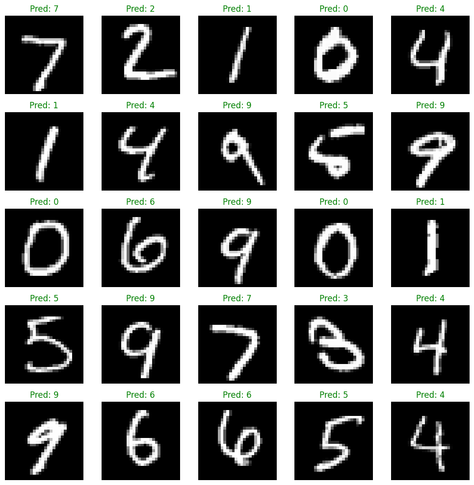

# Image Classification with OOP

This task involved building three different classification models for the MNIST dataset using an Object-Oriented Programming (OOP) approach. The models implemented were:

1. Random Forest
2. Feed-Forward Neural Network (FNN)
3. Convolutional Neural Network (CNN)

Each model was designed as a separate class implementing the `MnistClassifierInterface` with two abstract methods: `train()` and `predict()`. The models were trained and tested on the MNIST dataset using the PyTorch library. To ensure flexibility and a unified interface, all models were encapsulated within the `MnistClassifier` class, which allows dynamic selection of the desired model (`rf`, `nn`, or `cnn`).

## Implementation Details

### **Random Forest Classifier**
- Uses Scikit-learn’s `RandomForestClassifier`.
- Performs **5-fold cross-validation** before training on the entire dataset.
- Converts PyTorch tensors to NumPy for compatibility.

### **Feed-Forward Neural Network (FNN)**
- A fully connected neural network with one hidden layer.
- Uses **ReLU activation** and **CrossEntropyLoss**.
- Trained using the **Adam optimizer**.

### **Convolutional Neural Network (CNN)**
- Two **convolutional layers** with ReLU activation and max pooling.
- A fully connected layer for final classification.
- Trained using **Adam optimizer** and **CrossEntropyLoss**.

Each model was trained on the MNIST dataset and evaluated on the test set.

## **Model Performance**
| Model | Test Accuracy |
|--------|-------------|
| **Random Forest** | **96.92%** |
| **Feed-Forward NN** | **97.66%** |
| **CNN** | **98.56%** |

## **CNN Model Predictions Visualization**
Below is an example screen capture of CNN model predictions.

## **Conclusion**
This task successfully implemented three classification models under a unified OOP structure, ensuring modularity and scalability. The CNN model outperformed both Random Forest and Feed-Forward NN.
