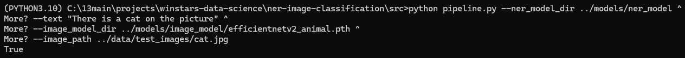
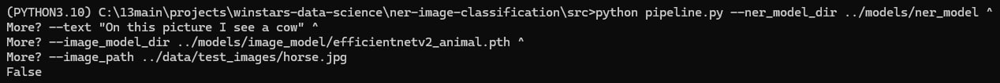
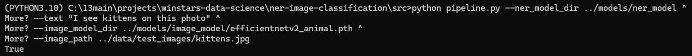

# Named entity recognition + image classification

## Introduction

Multi-modal machine learning pipeline that combines Named Entity Recognition (NER) and Image Classification to verify user-provided statements about images.\
The system will:
- Extract animal names from user text input using an NLP model.
- Classify the animal in the provided image using a Computer Vision model.
- Compare the results to determine if the text correctly describes the image, returning a boolean value (True/False).

## Dataset Requirements

For the NLP model, you can either use existing annotated text dataset from folder `data/ner-dataset` or generate your own dataset.

For the Computer Vision model, you need to download [Animals-10 dataset](https://www.kaggle.com/datasets/alessiocorrado99/animals10) from Kaggle. This dataset contains 10 classes of animals with total 27,000 images.

## Model Development

### NER Model (Named Entity Recognition):

The fine-tuned `dslim/bert-base-NER` model on the NER dataset to extract animal names from text. The dataset was generated using a custom-designed prompt to ensure balanced representation of 10 specific animal categories and varied sentence complexity with correct IO annotations, including multiple words per class with synonyms and plural forms.

### Image Classification Model:

Fine tuning a pre-trained `EfficientNetB2` model on the Animals-10 dataset for image classification. The model is trained to classify images into 10 animal categories.

---

Each model have separate, parametrized training and inference scripts.

---

### Final Pipeline
A Python script that takes text + image as input and returns a boolean value, using the trained NER and Image Classification models.

## Pipeline Flow

1. The user provides a text statement and an image.
    - Example input: `"There is a cow in the picture."` + Image of an animal.
2. The NER model extracts "cow" from the text.
3. The Image Classification model determines the actual animal in the image. 
4. The system compares results:
    - If the text animal matches the detected image animal → **Output: True**
    - Otherwise → **Output: False**

## Deliverables

- **Exploratory Data Analysis (EDA)** 
    - `notebooks/EDA.ipynb` - Jupyter notebook containing EDA on the NER dataset and ANIMALS-10 dataset.
- **NER Model Scripts:**
    - `src/ner/train_ner.py` - Script to train the NER model.
    - `src/ner/inference_ner.py` - Script to perform inference using the trained NER model.
- **Image Classification Model Scripts:**
    - `src/img_classification/train_image.py` - Script to train the Image Classification model.
    - `src/img_classification/inference_image.py` - Script to perform inference using the trained Image Classification model.
- **Final Pipeline Script:**
    - `src/pipeline.py` - Script to run the complete pipeline. User provides text and image, and the system returns True/False based on the comparison. Use the trained NER and Image Classification models for inference.

## Example Usage

